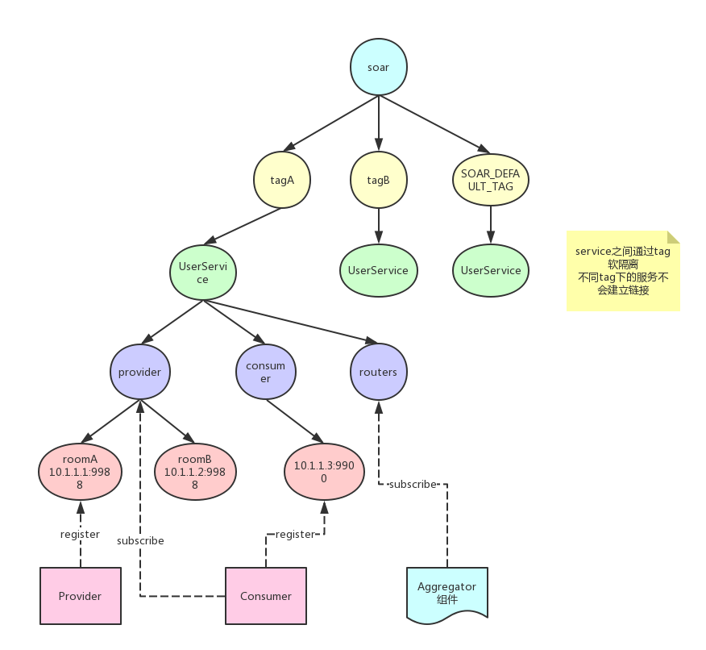
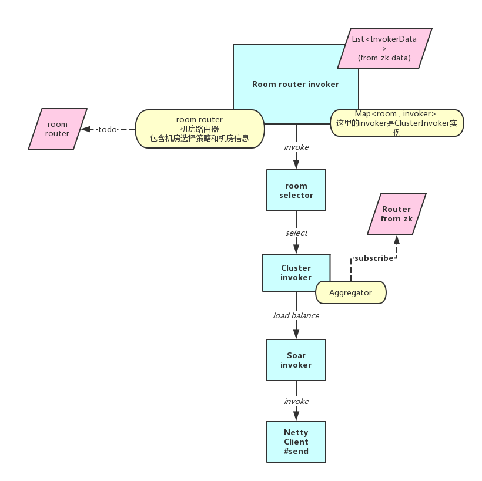

## Soar技术文档

### 功能需求
1. 跨机房切换
2. 支持异步（提供方异步）
3. 集群容错
4. 服务治理
5. Server端限流
6. client端负载均衡
7. 插件化
8. 泛化调用
9. 多语言支持（？）

### 核心接口/抽象
**Server**：服务器，包括开启和关闭 
**Exchanger**：交换器，负责实际上数据传输 
**Filter**：过滤器 
**Cluster**：集群，负责做集群容错 
**Invoker**：服务/调用方抽象 
**SoarContext**：请求上下文 
**Registry**：注册中心 
**Serializer**：序列化 
**LoadBalancer**：客户端负责均衡 
**Breaker**：熔断 
**Cacher**：缓存服务 
**ServiceContainer**：服务容器（考虑支持spring和注解扫描两种方式实现） 

### soar注册中心树形结构
 

### soar多机房和集群容错

### protocol（tcp）

                                                        Protocol
    ┌ ─ ─ ─ ─ ─ ─ ─ ─ ─ ─ ─ ─ ─ ─ ─ ─ ─ ─ ─ ─ ─ ─ ─ ─ ─ ─ ─ ─ ─ ─ ─ ─ ─ ─ ─ ─ ─ ─ ─ ─ ─ ─ ─ ─ ─ ┐
         2   │   1   │    1   │     8     │      4      │
    ├ ─ ─ ─ ─ ─ ─ ─ ─ ─ ─ ─ ─ ─ ─ ─ ─ ─ ─ ─ ─ ─ ─ ─ ─ ─ ─ ─ ─ ─ ─ ─ ─ ─ ─ ─ ─ ─ ─ ─ ─ ─ ─ ─ ─ ─ ┤
             │       │        │           │             │
    │  MAGIC   Sign    Status   Request Id    Body Size                 Body Content             │
             │       │        │           │             │
    └ ─ ─ ─ ─ ─ ─ ─ ─ ─ ─ ─ ─ ─ ─ ─ ─ ─ ─ ─ ─ ─ ─ ─ ─ ─ ─ ─ ─ ─ ─ ─ ─ ─ ─ ─ ─ ─ ─ ─ ─ ─ ─ ─ ─ ─ ┘
    
    ┌ ─ ─ ─ ─ ─ ─ ─ ─ ─ ─ ─ ─ ─ ─ ─ ─ ─ ─ ─ ─ ─ ─ ─ ─ ─ ─ ─ ─ ─ ─ ─ ─ ─ ─ ─ ─ ─ ─ ─ ─ ─ ─ ─ ─ ─ ─ ─ ─ ┐
            * 消息头16个字节（8位）定长
            
* 2 // magic = (short) 0xbabe

            * 1 // 消息标志位, 低地址4位用来表示消息类型request/response/heartbeat等, 高地址4位用来表示序列化类型
            * 1 // 状态位, 设置请求响应状态
            * 8 // 消息id, long 类型

            * 4 // 消息体 body 长度, int 类型
    └ ─ ─ ─ ─ ─ ─ ─ ─ ─ ─ ─ ─ ─ ─ ─ ─ ─ ─ ─ ─ ─ ─ ─ ─ ─ ─ ─ ─ ─ ─ ─ ─ ─ ─ ─ ─ ─ ─ ─ ─ ─ ─ ─ ─ ─ ─ ─ ─ ┘
